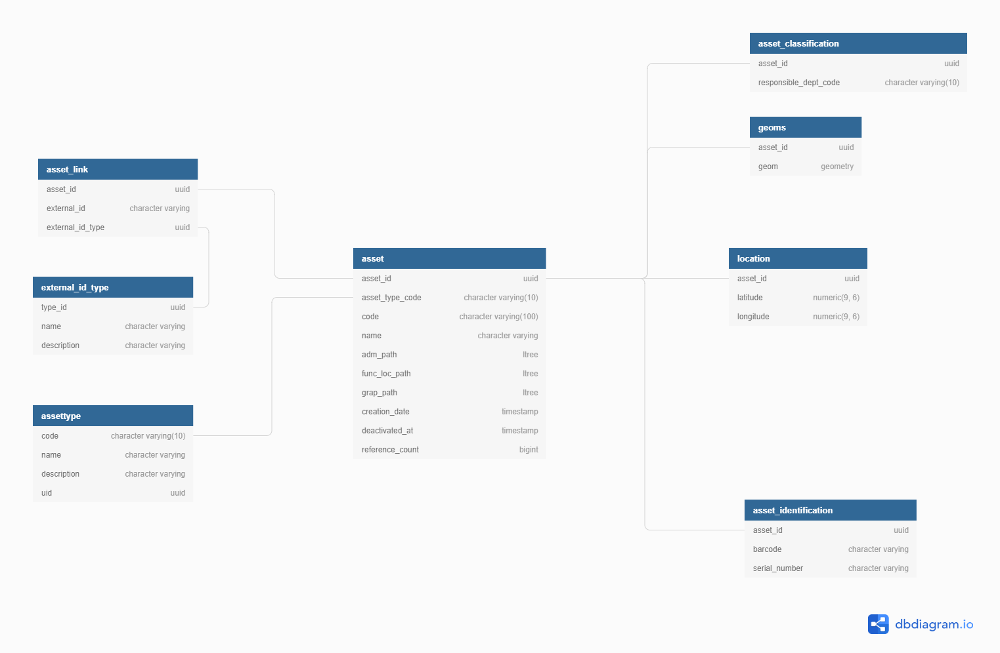
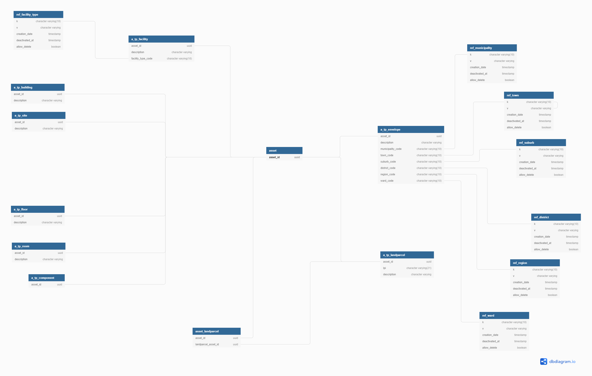
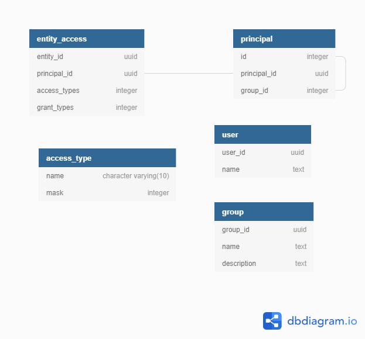

# Core Schema


> THIS DOCUMENT IS SEVERELY OUTDATED
> [Confluence](https://imqssoftware.atlassian.net/wiki/x/IwAhVw) contains the most up to date documentation.


Target Audience
---------------
|Section|Audience|
|---|---|
|0 Introduction|All|
|1 Core Directory|All|
|2 Shared Data|All, as it is relevant to all modules - it provides shared models|
|3 Audit|Take not for now. This will be accessed by as yet undefined APIs and can be retrofitted|
|4 Lookups|All, as it is relevant to all modules|
|5 Transactions|At this stage, probably only of interest to people with an Asset management hat on, unless you are interested in maintaining history|
|6 Life Cycle & Financials|At this stage, probably only of interest to people with an Asset management hat on|
|7 Hierarchies|All, as it provides the paths that need to go into the Core Directory, but the section is too incomplete to waste time on now|

TLDR
-----
If you want to skip all the reading and get going, you can create a populated database to play with. It will contain a representative **DTPW** data set.

 1. Run `createCore.bat` to create the database. You may want to modify the batch file to specify another name for the database
 2. Run `import.bat` to import the data
 
 **Note:** Some of the data takes a long time to load

House Rules
------------

* See [Schema Rules](schemaRules.md) for the naming conventions we employ.
* The **sql scripts are considered the master copy** of the schema. When making changes to the schema, please also update the `.io` files and dbdocs online. 

0 Introduction 
==============

Data is captured at a very granular level and aggregated to render various views on the data. These views are what end up in the various front-ends.


Principles
-----------
 1. Use `UUID`s so we can copy data between databases, also a naming convention across all possible types of assets becomes cumbersome.
 2. Use path strings: instead of having to traverse the trees do `like` queries
 3. Consider adding addition tags to this table for grouping
 4. We don't delete
 5. Lookup tables have string codes as primary keys (no int surrogate key)
 6. Rather than building a fully dynamic system, add columns or tables and adjust the aggregations accordingly.


Data Types
----------------
 * Code fields and Keys (`'k'`) in Lookup Tables are `VARCHAR(10)` 
 * Money is  `DECIMAL(19,4)`
 
About paths
-----------

```
 NOTE USING PATH STRINGS ALSO MAKES IT POSSIBLE TO EASILY HANDLE CHANGES OF COMPONENTS - USING EXPLICIT PARENT CHILD RELATIONSHIPS MAKE THIS IMPOSSIBLE


     [a]
    /   \
   [b] [c]
  /
 [d]

 [e] now replaces [b] and we don't delete [b] according to our basic  principles. This leaves [d] with two parents.


      [a]
    /  \  \
  [b] [e]  [c]
  /   /
   [d]

  We can mark [b] as inactive
```

1 Core Directory
================

To be modeled in the system an Asset has to reside in at least in the `asset` table. Optionally it may have:
* A Location e.g. Lat/Long and a path in the Location Hierarchy
* Spatial information (`location` table)
* Alias identities as defined by external systems (where we integrate with such systems) (`asset_link` table)
* Geometry (`geoms` table)
* An Asset Data Model
  


The `asset` table contains the primary UUID of the Asset a number of path strings (add a column to add a new path).  An Asset has a type. Each type has a row in a type specific table that attaches type specific information to the Asset. 

The *intrinsic* hierarchical relationship between Assets is maintained via the `func_loc_path`.  This makes use of the Postgres [`ltree`]( https://www.postgresql.org/docs/10/ltree.htmlextension).  For the **Public Works** example the types and their relationships are listed below.

```
                  +------------+
                  |            |
                  |  Envelope  |
                  |     0      |
                  +--+-----+---+
+--------------+     |     |      +------------+
|              |     |     |      |            |
|  Land Parcel +-----+     +------+  Facility  |
|              |                  |      1     |
+--------------+                  +----+-------+
                                       |         +------------+
                                       |         |            |
                                       +---------+  Building  |
                                       |         |     2      |
                                       |         +-----+------+
                                       |               |         +---------+
                                       |               |         |         |
                                       |               +---------+  Floor  |
                                       |                         |    3    |
                                       |                         +----+----+
                                       |                               |      +---------+
                                       |                               |      |         |
                                       |                               +------+  Room   |
                                       |                                      |    4    |
                                       |                                      +---------+
                                       |                                          |       +-------------+
                                       |                                          |       |             |
                                       |                                          +-------+  Component  |
                                       |                                                  |      5      |
                                       |                                                  +-------------+
                                       |          +--------+
                                       |          |        |
                                       +----------+  Site  |
                                                  |    2   |
                                                  +--------+
                                                      |       +-------------+
                                                      |       |             |
                                                      +-------+  Component  |
                                                              |      3      |
                                                              +-------------+
```

Note that this represent the collection of node types in the hierarchy, there is no requirement that all of the level be present. Levels may in some cases be present and in others not - even within the data set of the same client. A Room may be a child of a Facility.


The database contains tables:
* `a_tp_envelope`
* `a_tp_landparcel`
* `a_tp_facility`
* `a_tp_building`
* `a_tp_site`
* `a_tp_floor`
* `a_tp_room`
* `a_tp_component`



That are `LEFT` joined to `asset` based on the `asset_id`.  Some of these tables will contain additional type columns to further classify the Asset. E.g. `a_tp_facility.facility_type_code`

For **DTPW** The path is constructed from the Asset `code` field.  **NOTE** This means that the `code` column is actually redundant as used here. It contains the same information as the `func_loc_path` column. I'm leaving it in for now as we may use the code column differently in future.


### Location (TBD)
```
   RegionCode
     WardCode
       SuburbCode
         Street
           Stand
             Building
               Floor
                 Room
```

### ADM Hierarchy
TBD

### GRAP17 / Financial Hierarchy
TBD

Querying the Core Directory
---------------------------

Querying of the database, using SQL, is allowed and encouraged. RESTful endpoints may also be added later to facilitate querying. Using a combination of path and type based search criteria most query requirements can be satisfied.  It is recommended to query via views.  Standard views will be added as the use cases crystalise.  We will make use of different database user with different level of access to control access to
the database. The idea is that when reading from the database, you make use of a user that has strictly read-only access to the database.

```
-- Find an Asset of Type `ENVELOPE` with a name starting with 'Groote'
SELECT asset_id, asset_type_code,code,name,func_loc_path 
FROM asset 
WHERE name LIKE 'Groote%' AND  asset_type_code = 'ENVELOPE';
```


|asset_id|asset_type_code|code|name|func_loc_path|
|:-------|:--------------|:---|:---|:------------|
|8bdbf1db-8bcb-49af-a37e-7219bb188a02|ENVELOPE|OMB|Groote Schuur Hospital|OMB|
|0924c2e9-d967-420a-81a3-6d9cab06c4fd|ENVELOPE|2876|Groote Schuur Hospital|2876|
|8fd6dc04-cdcd-458b-ba62-2e4e2c4cb7e6|ENVELOPE|P2876|Groote Schuur Hospital|P2876|
`

```
-- Find children with a parent of `2876`
SELECT asset_id, asset_type_code,code,name,func_loc_path 
FROM asset 
WHERE func_loc_path <@ '2876' AND asset_type_code IN ('FACILITY','SITE','BUILDING');
```


|asset_id|asset_type_code|code|name|func_loc_path|
|:-------|:--------------|:---|:---|:------------|
|d53821e6-66c9-4cb9-bbd8-d333b6aa14d9|BUILDING|2876-SQ|Groote Schuur Hospital-GSH Squash Courts|2876.SQ|
|559d0f77-480f-4be4-bcc7-9e242fba3065|BUILDING|2876-QB|Groote Schuur Hospital-Q Block|2876.QB|
|6d38c815-c512-44ff-9949-a31eb2d0a60b|BUILDING|2876-PD|Groote Schuur Hospital-Printing Department|2876.PD|
|ed603e36-10ad-4a0f-aef9-fceea8a423b5|BUILDING|2876-PB|Groote Schuur Hospital-Parking Block |2876.PB|
|9047c5b3-c03c-43b7-bc88-ffcd0b95c19a|BUILDING|2876-OPD|Groote Schuur Hospital-OPD Building|2876.OPD|
|19c32992-366d-4512-8f89-d86094cdbb9d|BUILDING|2876-OMB|Groote Schuur Hospital-OMB Building|2876.OMB|
|0761e08f-3d49-4c7e-a10e-ebd0a09bcfe4|BUILDING|2876-OC|Groote Schuur Hospital-Old Canteen|2876.OC|
|bcefbc12-2df5-4418-857b-3dc7894219fd|BUILDING|2876-NM|Groote Schuur Hospital-Nico Malan Hall|2876.NM|
|2b6300d7-91fd-4510-a5f2-10abdd4a2661|BUILDING|2876-NGSH|Groote Schuur Hospital-NGSH Building|2876.NGSH|
|6032bdf9-1b63-40c7-8533-9a20f8435d0c|BUILDING|2876-MOQ|Groote Schuur Hospital-MO Quarters|2876.MOQ|
|c68610de-9b8a-4702-bfe0-861040d1af23|BUILDING|2876-MB|Groote Schuur Hospital-Maternity Building|2876.MB|
|bfa34b9d-1fab-49e1-bed8-55eedeef8bcb|BUILDING|2876-GC|Groote Schuur Hospital-GSH Chapel|2876.GC|
|b2fdf458-08d4-4fda-bbb7-8586c78168e5|BUILDING|2876-ENG|Groote Schuur Hospital-Engineers Workshop|2876.ENG|
|8f32b919-b617-40d1-b565-89a1e7af5d07|BUILDING|2876-CNQ|Groote Schuur Hospital-Clarendon Nurses Quarters|2876.CNQ|
|387e7ed7-7ab0-47ce-b745-bbe67bba8cc2|BUILDING|2876-CHB|Groote Schuur Hospital-Clarendon House Building|2876.CHB|
|a527ccb5-cfc2-47f3-afb6-5798b94ef961|BUILDING|2876-CARCOL-OB|Groote Schuur Hospital-Carinus Nursing College Outbuilding|2876.CARCOL.OB|
|6ba55751-2891-4a59-b3d1-d2915108f370|BUILDING|2876-CARCOL|Groote Schuur Hospital-Carinus Nursing College|2876.CARCOL|
|24fef1c3-95d7-4187-aae6-5587ed7493c4|BUILDING|2876-BJ|Groote Schuur Hospital-Block J|2876.BJ|
|b6eab77f-d746-4ab4-9d94-4f6ce59d6885|BUILDING|2876-BH|Groote Schuur Hospital-Boiler House|2876.BH|
|221a73f4-e966-436d-9fc4-d44382cbdcc5|BUILDING|2876-AP|Groote Schuur Hospital-Admin Prefab|2876.AP|
|00002920-d35c-4f96-8f16-95c952dad91e|BUILDING|2876-BL|Groote Schuur Hospital-Block L|2876.BL|
|17f25370-1bf5-4224-a788-ae914d070ee0|SITE|2876-S|Groote Schuur Hospital-Site|2876.S|


```
-- Join extra information 
SELECT 
	asset.asset_id, asset_type_code, code, name, func_loc_path, a_tp_building.* 
FROM asset 
	LEFT JOIN a_tp_building ON a_tp_building.asset_id = asset.asset_id
	LEFT JOIN a_tp_site ON a_tp_site.asset_id = asset.asset_id
WHERE func_loc_path <@ '2876' AND asset_type_code IN ('SITE','BUILDING');
```

Database level security
-----------------------

Please refer to  [Database Users](DatabaseUsers.md). There are very strict rules to adhere to.

Core API
--------
* All insertions and updates must go through the API
* For each request to endpoint the implementing service must
  + *Authenticate* the user
  + *Audit log* what was requested and the outcome

See the [API definitions](API/Assets.md) 

Adding an Asset
------------------

The steps required to add an asset are as follows:
1. Check that you have `CREATE` permissions on the relevant Asset Type
2. Insert the data into the core tables:  `asset`, `location`, `geom`, `assetlink`, `asset_classification`, `asset_identification`. Of these only `asset` is mandatory.
3. Add the additional data pertinent to the specific Asset Type to `a_tp_xxx`
4. Add Audit entries  
5. Apply access logic (see Access Control List below)

Access Control List
-------------------



**TODO**: Change schema so we add `description` and `name` to `principal` table with `isGroup` flag (say) and do away with `principal` and `group` tables
All Assets are subject to access control. Each entity (such as an Asset) in the system has an entry in the `entity_access` table that associates a `principal` with two bit masks. A *Principal* is either a user or group. One mask defines the permissions granted to the Principal and the other the permissions the principal may grant to other principals.  The meaning of the bits are defined in `access_type` and are currently:

|Name    |Value|
|--------|-----|
|`NONE`  |`0`  |
|`CREATE`|`1`  |
|`READ`  |`2`  |
|`UPDATE`|`4`  |
|`DELETE`|`8`  |

Principals are linked to groups via the `principal` table. Both a User and a Group are Principals.  The effective access of a User to an entity is determined by OR-ing the masks of all of the groups (by self-joining on the `principal` table) to which the user belongs.

The granting/revoking of permissions as well as the adding of Groups are controlled via database functions.

**NOTE:** The Core Service will handle the restriction of access to entities when the API is used. When reading directly from the database consuming service need to use function `access_control.fn_get_effective_access(principal uuid, entity uuid)` in the where clause to restrict visibility of results.


The assigning of access is completely removed from evaluating the permissions to a specific entity.
 Create access is only relevant to creation so you must have had it to start with.  For other permissions,  a sensible default behaviour would be:  
 If you have the permission on the asset type then assign that same permission to the instance. 

API
----
[API](API/AccessControl.md)

2 Shared Data
=================

These are some general concepts that will prove useful to many modules. They are logically part of the Core,
but one would expect them to be loosely coupled to Assets (i.e. the majority of Assets won't have any)

* Supplier
* Facility via AssetFacility linking table
* Unit (as in SI or Imperial)
* Postal codes


"https://dbdiagram.io/d/5def646cedf08a25543ee970"


3 Lookups
=========

These are intended to also be shared between all of the modules for read purposes. Only the `Owner` (see schema) is allowed to write to the table.  
**TODO** *We will have to figure out how to manage the identities of the owners and how to manage this. This restriction is not enforced yet.*

Lookup tables extend the base table `kv_base`.  

|Column|Type|Information|
|------|----|-----------|
|`k`|`character varying(10)`|Keys may only contain alphanumeric characters and '_' and empty strings are not allowed ('')|
|`v`|`character varying`||
|`creation_date`|`timestamp without time zone`|Defaults to insert time|
|`deactivated_at`|`timestamp without time zone`|We normally don't allow deletion|
|`allow_delete`|`boolean`|Override flag to indicate that the row may in fact be deleted|Defaults to false|

There is a registry of all lookups `kv_type`.

|Column|Type|Information|
|------|----|----------|
|`code`|`character varying(10)`|Codes may only contain alphanumeric characters and '_' and empty strings are not allowed ('')|
|`name`|`character varying`|
|`description`|`character varying`|Optional description| 
|`owner`| `uuid`|The entity that is the owner of this lookup type. Owner is deliberately vague.|
|`table`|`character varying`|The name of the table. Can be qualified by schema name. The system will check that the table exists upon an insert to the `kv_type`|

The API to manage lookups only specifies the `code` and the system then looks up the table from `kv_type`.

When creating a lookup table it is the responsibility of the creator to:
1. Create the lookup table
2. Add its FK constraints that link the lookup table to other tables that reference it
3. Due to limitation of the Postgres `INHERITS` mechanism you also need to add indexes (e.g. on k). Note that you need an index on `v` if you want a bi-directional lookup
4. Insert a row in `kv_type`

    
Currently the following standard lookup tables are included:

|Table|Description|
|-----|-----------|
|`ref_district`|District municipality or metro|
|`ref_municipality`|Local Municipality|
|`ref_region`|Region|
|`ref_suburb`|Suburb in Town|
|`ref_town`|Town|
|`ref_ward`|Electoral ward|

https://dbdiagram.io/d/5def616cedf08a25543ee93f" 

**TODO** *The front-end already supports reading from db.table.field. We should embrace this and add a schema specifier.*

API
----
[API](API/Lookups.md)

4 Audit
=========

Actions against Assets generate entries in the Audit Log via the linking table AuditLink

https://dbdiagram.io/d/5def5fd8edf08a25543ee91e

There is an obvious duplication of data between the explicit Audit Log and the history provided by the Transaction table.  I would at this stage rather live with this duplication
rather than having everything audit related be underpinned by something that we have not completely figured out yet.

**TODO** **Initially we would need to make the field nullable** as we won't be writing the audit trail.

API
----
[API](API/Audit.md)


5 Transactions
================

https://dbdiagram.io/d/5def6931edf08a25543ee9b6

Attribute updates
-----------------
TBD

Financial Transactions
----------------------

Transactions decouple the submitted changes from the actual database representation of the entities that they affect. For now the plan is to fork the updates to the Transactions tables and the current state of the Assets. We therefore have all history and the exact current state. This will be very performnt for reading current financial values, but opening and closing values will require traversing the Transaction table.

If you want the state at a different point in history, you roll up all transactions from a given point in history to the required date. This gets rendered to a different set of tables that we can name and persist under the name of the user and the date (say).

To speed up the rendering, we may choose to keep some snapshots at say the end of a financial period. We must remember to trash these when we apply a corrective historic transaction though.


### Changing an Asset 

One transaction corresponds to a single field change brought about by the specific type of transaction executed. If multiple fields are affected by the type of transaction you will have multiple rows in the Transaction table. They are linked by a BatchId.

### Open questions

* The transaction mechanism will be able to track all Changes, including changes to the structure of the trees. Do we want to track all of them though?


Performance
-----------
Needles to say the Transaction table will rapidly grow in size. We should make use of the Postgres table partition functionality

e.g. if we partition by Year:

```
CREATE TABLE Transaction (
 ...

   EffectiveDate ...
 ...  

) PARTITION BY RANGE (EffectiveDate);
```
Add a partition on each financial year roll-over
```
CREATE TABLE Transaction_2019 PARTITION OF Transaction

   FOR VALUES FROM ('2019-01-01') TO ('2019-12-31');

CREATE TABLE Table_2020 PARTITION OF Transaction

   FOR VALUES FROM ('2020-01-01') TO ('2020-01-01');
```

6 Life Cycle & Financials
=========================

These link `1:{0,1}` to Assets

https://dbdiagram.io/d/5def6a03edf08a25543ee9c4


**Observation:** *Lifecycle and financials do not require tamper check if they can be regenerated*

Financials
----------

Financial Transactions known so far:
  * DATALOAD (The setting of the values when we create the asset register)
  * ADDITION
  * WIP TRANSFER
  * DEPRECIATE
  * UPGRADE
  * IMPAIR
  * REVALUE
  * MAINTENANCE
  * RECLASSIFY
  * DERECOGNISE


For a given Asset the Financial Values can be calculate from the Transaction table as listed below. Note the following place holders:

|Placeholder|Description|
|---|---|
|`$FIN_YEAR_START$`|The start of the Financial Year (year/month/day)|
|`$FIN_YEAR_END$`|The end of the Financial Year(year/month/day)|
|`$NOW$`|The current timestamp|

Also **THERE IS OF COURSE A WHERE AssetId = xxxx REQUIRED, I have omitted it to keep things concise.**


|Account|Derived value|As|
|:---|:---|:---|
|Depreciation|DepreciationLastDate|`select MAX("EffectiveDate") as "DepreciationLastDate" from |Transaction where "TransactionType" = 'DEPRECIATION' and "EffectiveDate" < $FIN_YEAR_END$`|
||DepreciationOpening|`select SUM("Amount") as "DepreciationClosing" from Transaction where TransactionType = 'DEPRECIATION' and Field = 'Depreciation' and "EffectiveDate" <= $FIN_YEAR_START$`|
||DeprecitiationClosing|`select SUM("Amount") as "DepreciationClosing" from Transaction where TransactionType = 'DEPRECIATION' and Field = 'Depreciation' and "EffectiveDate" < $FIN_YEAR_END$`|
|| DepreciationFinYtd|`select SUM("Amount") as "DepreciationFinYtd"  from Transaction where TransactionType = 'DEPRECIATION' and Field = 'Depreciation' and "EffectiveDate" < $NOW$`|
|Impairment|||
|Cost|CostOpening|`select SUM("Amount") as "CostOpening" from Transaction where Field = 'Cost' and "EffectiveDate" <= $FIN_YEAR_START$`|
||CostClosing|`select SUM("Amount") as "CostClosing" from Transaction where Field = 'Cost' and "EffectiveDate" < $FIN_YEAR_END$`|
||TransferCost|`select SUM("Amount") as "TransferCost"  from Transaction where Field = 'Cost' and "EffectiveDate" < $NOW$`|
|Reclassification|ReclassificationLastDate|`select MAX("EffectiveDate") as "ReclassificationLastDate" from Transaction where "TransactionType" = 'RECLASSIFICATION' and "EffectiveDate" < $FIN_YEAR_END$`|
||ReclassificationCost|`select SUM("Amount") as "ReclassificationCost" from Transaction where TransactionType = 'RECLASSIFICATION' and Field = 'Cost' and "EffectiveDate" < $NOW$`|
||ReclassificationDepreciation|`select SUM("Amount") as "ReclassificationDepreciation"  from Transaction where TransactionType = 'RECLASSIFICATION' and Field = 'Depreciation' and "EffectiveDate" < $NOW$`|
||ReclassificationImpairment|`select SUM("Amount") as "ReclassificationImpairment"  from Transaction where TransactionType = 'RECLASSIFICATION' and Field = 'Impairment' and "EffectiveDate" < $NOW$`|
|Revaluation|RevaluationLastDate|`select MAX("EffectiveDate") as "RevaluationLastDate" from Transaction where "TransactionType" = 'REVALUATION' and "EffectiveDate" < $FIN_YEAR_END$`|
||RevaluationReserveOpening|``|
||RevaluationReserveClosing|``|
||RevaluationReserveFinYTD|``|
||RevaluationReserveFinYTDDepreciation|``|
||RevaluationReserveFinYTDImpairment|``|
||RevaluationAmount||`select SUM("Amount") as "ReclassificationImpairment"  from Transaction where TransactionType = 'REVALUATION' and Field = 'Cost' and "EffectiveDate" < $NOW$`|
|Derecognition|DerecognitionDate|`select MAX("EffectiveDate") as "DerecognitionDate" from Transaction where "TransactionType" = 'DERECOGNITION' and "EffectiveDate" < $FIN_YEAR_END$`|
||DerecognitionCost|``|
||DerecognitionDepreciation|``|
||DerecognitionImpairment|``|		
||RevaluationReserveFinYTDImpairment|``|
||RevaluationReserveOpening|``|
||RevaluationAmount|``|
|Addition|AdditionLastDate|`select MAX("EffectiveDate") as "AdditionLastDate" from Transaction where "TransactionType" = 'ADDITION' and Field = 'Cost' and "EffectiveDate" < $FIN_YEAR_END$`|
||AdditionOpening|`select SUM("Amount") as "AdditionOpening" from Transaction where TransactionType = 'ADDITION' and Field = 'Cost' and "EffectiveDate" <= $FIN_YEAR_START$`|
||AdditionClosing|`select SUM("Amount") as "AdditionClosing" from Transaction where TransactionType = 'ADDITION' and Field = 'Cost' and "EffectiveDate" < $FIN_YEAR_END$`|
||AdditionFinYTD|`select SUM("Amount") as "AdditionFinYtd"  from Transaction where TransactionType = 'ADDITION' and Field = 'Cost' and "EffectiveDate" < $NOW$`|				
					
					
These values are calculated from other calculated values:
* CarryingValue		
* CarryingValueOpening							
* CarryingValueClosing


Life Cycle
-----------

All updates other than to financial value are set replacing a ond value with a new value. You could go for a dynamic solution 
based on something like:

```
select 
	(
	  case
		  when "DataType" = T_SLONG then Delta_T_SLONG
		  when "DataType" = T_ULONG then Delta_T_ULONG
		  when "DataType" = T_MONEY then Delta_T_MONEY
		  when "DataType" = T_STRING then Delta_T_STRING
		  when "DataType" = T_BOOLEAN then Delta_T_BOOLEAN
		  when "DataType" = T_POLYGON then Delta_T_POLYGON
		  else
	  end
  	) as "Value"
  from from Transaction where EffectiveDate < $NOW$ order by EffectiveDate desc limit 1`
```

But, since you know what the types are for the individual fields, you can construct a view that directly queries the correct field

```
  select Delta_T_ULONG as "aaa" from Transaction where EffectiveDate < $NOW$ order by EffectiveDate desc limit 1`
		
```


7 Hierarchies
=============


These are managed in the Classifications and Templates databases. The hierarchies themselves are maintained in the Classifications database, whereas the attribute data that constitute the model parameters reside in Template service.  IMQS Keys manages the data in these two services. Other services exchange path strings only.

8 ADM 
=====

TBD
//

//
// Template Database (TBD)
// 
Table AssetADM {
  AdmId UUID  PK
  DescriptorSizeUnit   VARCHAR(10) [not null]
  ComponentDesc        VARCHAR
  Extent               DECIMAL(19,4) [null]  
  ExtentUnit           VARCHAR(10) [not null]
  ExtentUnitRate       DECIMAL(19,4) [null]  
  MeasurementModelId   VARCHAR(10) [not null, note: 'These may be enums?']
  DepreciationMethodId VARCHAR(10) [not null, note: 'These may be enums?']
  
  TamperCheck VARCHAR [not null]
}

Ref: "AssetADM"."DescriptorSizeUnit" - "Unit"."Code"
Ref: "AssetADM"."ExtentUnit" - "Unit"."Code"

https://dbdiagram.io/d/5def616cedf08a25543ee93f

### Location Hierarchy (TBD)
```
   RegionCode
     WardCode
       SuburbCode
         Street
           Stand
             Building
               Floor
                 Room
```


### SCOA Hierarchies
TBD

9 Code Review Guidelines
======================
* Naming conventions
* Foreign keys
* NULL / NOT NULL
* CHECK constraints
* Avoid triggers
* Default values
* Indexing